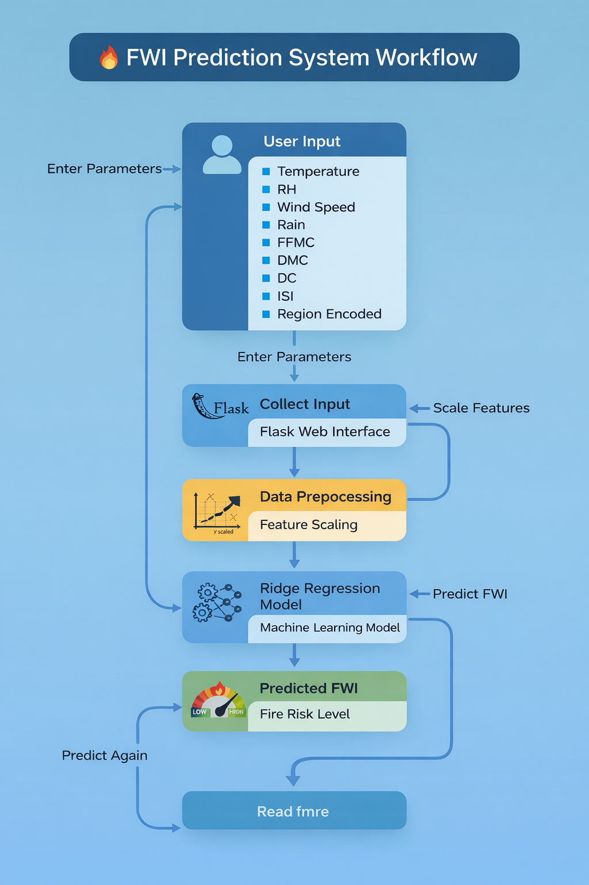

# FWI Predictor - Forest Fire Weather Index Prediction System


The **FWI Predictor** is a machine learning-based system designed to predict the Forest Fire Weather Index (FWI) using weather and forest condition data. This project combines data preprocessing, exploratory data analysis (EDA), machine learning modeling, and a web-based interface for making predictions on forest fire risk.


## Input Features
- **Temperature**: Air temperature (°C)
- **RH**: Relative humidity (%)
- **Ws**: Wind speed (km/h)
- **Rain**: Total rainfall (mm)
- **FFMC**: Fine Fuel Moisture Code
- **DMC**: Duff Moisture Code
- **DC**: Drought Code
- **ISI**: Initial Spread Index
- **Region**: Geographic region (encoded numerically)

## Target Variable
- **FWI**: Forest Fire Weather Index (numerical value indicating fire danger level)

## Technical Stack

- **Python 3.11+**
- **Data Processing**: pandas, numpy
- **Machine Learning**: scikit-learn
- **Visualization**: matplotlib, seaborn
- **Web Framework**: Flask, Flask-CORS
- **Data Serialization**: pickle

## Workflow



## Installation and Setup
### Step 1: Clone the Repository

```bash
git clone https://github.com/yourusername/FWI.git
cd FWI
```
### Step 2: Create a Virtual Environment
 
```bash 
python -m venv venv
```
### Step 3: Activate the Virtual Environment

Activate the virtual environment based on your operating system.

```bash 
# Windows
venv\Scripts\activate
```
```bash 
# macOS / Linux
source venv/bin/activate
```
### Step 4: Install Required Dependencies

Install all necessary Python libraries listed in the requirements.txt file.

```bash 
pip install -r requirements.txt'
```
### Step 5: Run the Flask Application

```bash 
python app.py
```
### Step 6: Open the Application in Browser

Access the application using the local development URL.
```bash 
`http://127.0.0.1:5000`
```
## Installation and Setup


## Web Application Output Screens

Home page interface


Predict page


## conclusion
This project presents a Fire Weather Index (FWI) Prediction System using machine learning and Flask to assess forest fire risk based on key meteorological and fuel parameters. A Ridge Regression model was used to ensure stable and accurate predictions through effective preprocessing and feature scaling. The system demonstrates how machine learning and web technologies can support early fire risk assessment and environmental disaster prevention.


