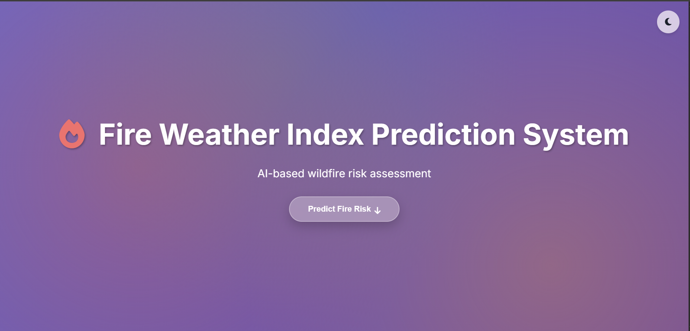
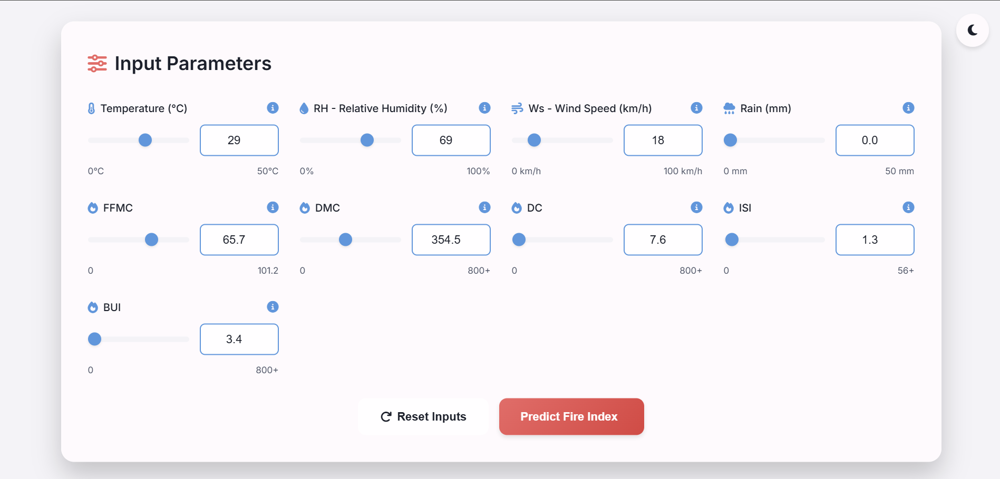
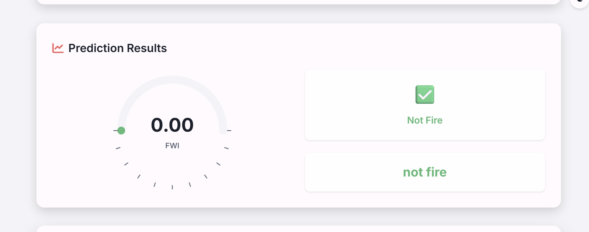
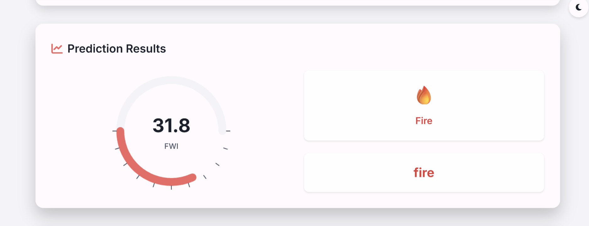
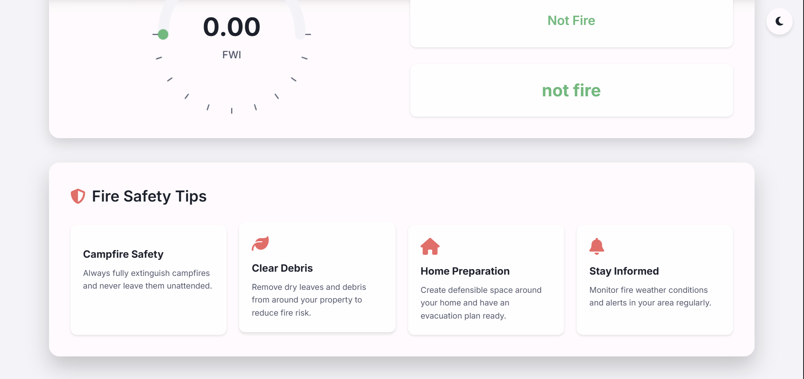

# Fire Weather Index (FWI) Prediction App

## Project Overview

This is a modern web application that predicts the Fire Weather Index (FWI) using a machine learning model trained on environmental parameters. The FWI is a numeric rating of fire intensity that helps in assessing wildfire risk. The application features a responsive web interface with real-time predictions, visual risk indicators, and an intuitive user experience.

The backend is built with Flask and uses a Ridge regression model to make predictions based on weather and fuel moisture conditions. The frontend provides an interactive form for inputting parameters and displays the predicted FWI along with risk level categorization.

## Input Features

The model requires the following 9 input parameters:

- **Temperature** (°C)
- **Relative Humidity** (RH) (%)
- **Wind Speed** (Ws) (km/h)
- **Rain** (mm)
- **FFMC** (Fine Fuel Moisture Code)
- **DMC** (Duff Moisture Code)
- **DC** (Drought Code)
- **ISI** (Initial Spread Index)
- **BUI** (Buildup Index)

## Output Features

The application outputs:

- **FWI Value**: A numeric prediction of the Fire Weather Index (0+)
- **Risk Level**: Categorical risk assessment based on FWI value:
  - 🟢 **Low**: FWI < 5
  - 🟡 **Moderate**: 5 ≤ FWI < 20
  - 🟠 **High**: 20 ≤ FWI < 40
  - 🔴 **Extreme**: FWI ≥ 40
- **Visual Indicators**: Gauge chart and color-coded risk bar for easy interpretation

## Software Requirements

### Python Dependencies
- flask==3.0.0
- flask-cors==4.0.0
- numpy==1.24.3
- pandas==2.0.3
- scikit-learn==1.3.2
- joblib==1.3.2

### System Requirements
- Python 3.8 or higher
- Modern web browser (Chrome, Firefox, Safari, Edge)
- Internet connection (for loading external resources like Google Fonts)

### Model File
- `ridge.pkl`: Pre-trained Ridge regression model (must be present in the project directory)

## How to Run Locally

### Prerequisites
1. Ensure Python 3.8+ is installed on your system
2. Ensure the `ridge.pkl` model file is present in the project directory

### Step-by-Step Instructions

**Step 1: Clone the repository**
```bash
git clone -b Gayatri https://github.com/Aspire-Infolabs/FWI_Prediction_Batch8.git
cd FWI_Prediction_Batch8
```

**Step 2: Create a Virtual Environment**
- **Windows**
  ```bash
  python -m venv venv
  venv\Scripts\activate
  ```
- **macOS / Linux**
  ```bash
  python -m venv venv
  source venv/bin/activate
  ```

**Step 3: Install Required Libraries**
```bash
pip install -r requirements.txt
```

**Step 4: Run the Flask Application**
```bash
python app.py
```

**Step 5: Open in Browser**
```
http://127.0.0.1:5000/
```

### Alternative: Using Provided Scripts (Windows)

#### Windows PowerShell
```powershell
.\run_app.ps1
```

#### Windows Command Prompt
```batch
run_app.bat
```

## Results

### Main Application Interface


### Input Parameters For Prediction


### Low Risk Prediction Result


### Fire Risk Prediction Result


### Fire Safety Tips 


### Option: Direct Browser (Frontend Only)
If you only want to see the frontend interface without the backend predictions:
1. Open `index.html` directly in any modern web browser
2. Note: Predictions will use mock data since the backend won't be running

## Fire Safety Tips

### Understanding Fire Weather Index (FWI)
The Fire Weather Index is a numeric rating that indicates the potential for wildfire occurrence and spread. Higher FWI values indicate greater fire danger.

### Risk Level Guidelines
- **🟢 Low (FWI < 5)**: Safe conditions, low fire risk
- **🟡 Moderate (5 ≤ FWI < 20)**: Monitor conditions, take basic precautions
- **🟠 High (20 ≤ FWI < 40)**: High danger, implement fire safety measures
- **🔴 Extreme (FWI ≥ 40)**: Extreme danger, evacuate if necessary

## Usage

1. Open the application in your web browser
2. Adjust the input parameters using the sliders or number inputs
3. Click the "Predict Fire Index" button
4. View the predicted FWI value, risk level, and visual indicators
5. Use the dark/light mode toggle for better visibility
6. Check the fire safety tips section for additional information

## API Endpoints

- `GET /`: Serves the main HTML page
- `POST /predict`: Accepts JSON with input features, returns FWI prediction
- `GET /health`: Health check endpoint
- `GET /<filename>`: Serves static files (CSS, JS, etc.)

